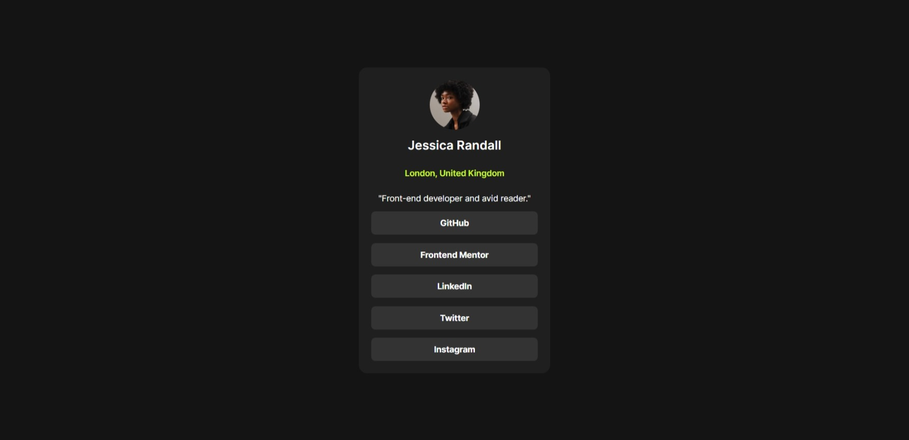

# Social links profile solution

This is a solution to the [Social links profile challenge on Frontend Mentor](https://www.frontendmentor.io/challenges/social-links-profile-UG32l9m6dQ). Frontend Mentor challenges help you improve your coding skills by building realistic projects.

### Screenshot

### Link

Live Site URL: [visit page](https://aditya-en.github.io/frontend-social-links/)

### Built with

- Semantic HTML5 markup
- CSS custom properties
- Flexbox
- CSS Grid
- Mobile-first workflow

## Author

- Frontend Mentor - [@Aditya-en](https://www.frontendmentor.io/profile/Aditya-en)
- Twitter - [@adi\_\_twts](https://www.twitter.com/adi__twts)
